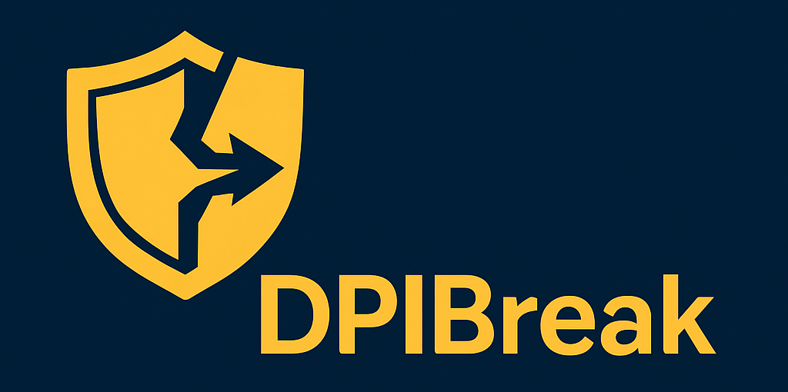

# DPIBreak

Lightweight DPI circumvention tool in Rust. Available on Linux and
Windows.

## Disclaimer

This tool was created for technical research and educational purposes.
Please make sure your usage complies with the laws of your country.
The authors are not responsible for any misuse.

## License

This program is free software: you can redistribute it and/or modify
it under the terms of the GNU General Public License as published by
the Free Software Foundation, either version 3 of the License, or (at
your option) any later version.

This program is distributed in the hope that it will be useful, but
WITHOUT ANY WARRANTY; without even the implied warranty of
MERCHANTABILITY or FITNESS FOR A PARTICULAR PURPOSE. See the GNU
General Public License for more details.

You should have received a copy of the GNU General Public License
along with this program. If not, see <https://www.gnu.org/licenses/>.

